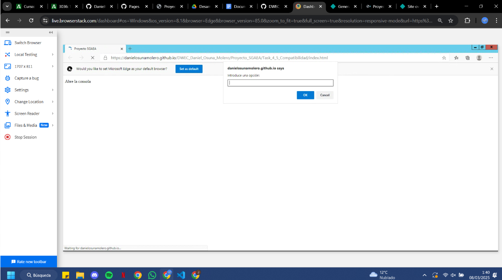
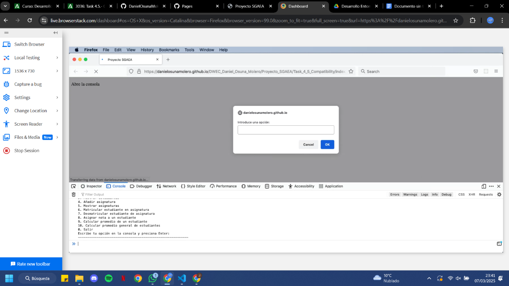

# Polyfilling y Transpilación SGAEA

Este documento describe el proceso de implementación, configuración y comprobación del funcionamiento de **Node.js**, **Webpack** y **Babel** para realizar **polyfilling** y **transpilación** en el proyecto **SGAEA** (Sistema de Gestión Académica de Estudiantes y Asignaturas). El objetivo es asegurar que el proyecto pueda ejecutarse correctamente tanto en navegadores antiguos como en modernos.

---

## Descargar Node.js y comenzar un proyecto nuevo
Para iniciar un nuevo proyecto, abre la terminal en la carpeta del proyecto y ejecuta el siguiente comando:

```sh
npm init -y
```

---

## Instalar los paquetes necesarios
Para realizar el **polyfilling** y la **transpilación**, instala los siguientes paquetes:

```sh
npm install --save-dev webpack webpack-cli webpack-merge @babel/core @babel/preset-env babel-loader core-js regenerator-runtime copy-webpack-plugin cross-env html-webpack-plugin
```

### Explicación de los paquetes:

- `webpack` 
- `webpack-cli`
- `webpack-merge`
- `@babel/core` y `@babel/preset-env`
- `babel-loader` 
- `core-js` 
- `regenerator-runtime` 
- `copy-webpack-plugin`
- `cross-env` 
- `html-webpack-plugin` 

---

## Configuración de Webpack
Se deben configurar tres archivos:

### **`webpack.antiguo.js`**
Este archivo genera un bundle compatible con navegadores antiguos:

```js
const path = require('path');
const { merge } = require('webpack-merge');
const common = require('./webpack.comun.js');

module.exports = merge(common, {
    output: {
        filename: 'bundle.antiguo.js',
    },
    module: {
        rules: [
            {
                test: /\.js$/,
                exclude: /node_modules/,
                use: {
                    loader: 'babel-loader',
                },
            },
        ],
    },
});
```

### **`webpack.moderno.js`**
Este archivo genera un bundle compatible con navegadores modernos:

```js
const path = require('path');
const { merge } = require('webpack-merge');
const common = require('./webpack.comun.js');

module.exports = merge(common, {
    output: {
        filename: 'bundle.moderno.js',
    },
});
```

### **`webpack.comun.js`**
Este archivo establece la configuración compartida:

```js
const path = require('path');
const CopyWebpackPlugin = require('copy-webpack-plugin');

module.exports = {
    entry: './js/main.js',
    output: {
        path: path.resolve(process.cwd(), 'compilado', process.env.modo),
    },
    mode: process.env.modo,
    plugins: [
        new CopyWebpackPlugin({
            patterns: [{ from: './index.html', to: '.' }],
        }),
    ],
};
```

---

## Configuración de Babel
Se requiere un archivo **`babel.config.js`** para definir las directrices de transpilación:

```js
module.exports = {
    presets: [
        [
            '@babel/preset-env',
            {
                targets: '> 0.25%, not dead',
                useBuiltIns: 'usage',
                corejs: 3,
            },
        ],
    ],
};
```

---

## Configuración del HTML
Para incluir ambos bundles en el proyecto, usa el siguiente código en el **`index.html`**:

```html
<head>
    <script defer type="module" src="bundle.moderno.js"></script>
    <script defer src="bundle.antiguo.js"></script>
</head>
```

Esto permite que cada navegador seleccione y ejecute el bundle que mejor se adapte a sus capacidades.

---

## Creación de scripts en `package.json`
Para facilitar la ejecución, añade estos scripts en `package.json`:

```json
"scripts": {
    "antiguo": "cross-env-shell webpack --config webpack.antiguo.js --mode $modo",
    "moderno": "cross-env-shell webpack --config webpack.moderno.js --mode $modo",
    "des": "cross-env-shell modo=development run-s antiguo moderno",
    "prod": "cross-env-shell modo=production run-s antiguo moderno",
    "clean:comp": "rimraf compilado",
    "start": "run-s clean:comp des prod"
}
```

### Descripción de los scripts:
- **`antiguo`** → Crea el bundle para navegadores antiguos.
- **`moderno`** → Crea el bundle para navegadores modernos.
- **`des`** → Genera ambos bundles en modo desarrollo.
- **`prod`** → Genera ambos bundles en modo producción.
- **`clean:comp`** → Elimina la carpeta `compilado`.
- **`start`** → Borra `compilado` y genera nuevos bundles.

---

## Generación de los bundles y comprobación
Para generar los bundles, ejecuta:

```sh
npm run start
```

Esto creará la siguiente estructura:

```
compilado/
├── production/   # Bundles optimizados para producción
└── development/   # Bundles optimizados para desarrollo
```


## Pruebas en navegadores

Para verificar que el código transpila y se ejecuta correctamente en distintos navegadores, se realizaron pruebas en BrowserStack en diferentes versiones:

## 📌 Prueba en Microsoft Edge 85 (Windows 8.1)


## 📌 Prueba en Firefox 99 (macOS Catalina)



